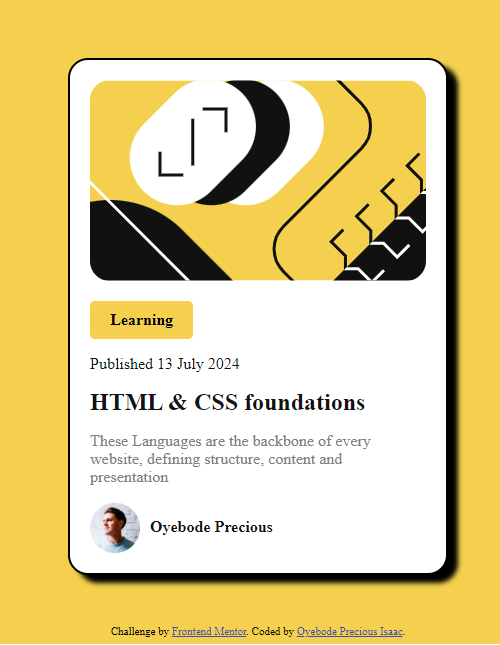

<!-- @format -->

# Frontend Mentor - Blog preview card solution

This is a solution to the [Blog preview card challenge on Frontend Mentor](https://www.frontendmentor.io/challenges/blog-preview-card-ckPaj01IcS). Frontend Mentor challenges help you improve your coding skills by building realistic projects.

## Table of contents

- [Overview](#overview)
  - [The challenge](#the-challenge)
  - [Screenshot](#screenshot)
  - [Links](#links)
- [My process](#my-process)
  - [Built with](#built-with)
  - [What I learned](#what-i-learned)
  - [Continued development](#continued-development)
  - [Useful resources](#useful-resources)
- [Author](#author)
- [Acknowledgments](#acknowledgments)

## Overview

### The challenge

Users should be able to:

- See hover and focus states for all interactive elements on the page
- View the webpage on different size screen (Responsiveness)

### Screenshot




### Links

- Solution URL: [Add solution URL here](https://your-solution-url.com)
- Live Site URL: [Add live site URL here](https://your-live-site-url.com)

## My process

- setup workspace
- created the layout for the project
- styling the layout
- add responsiveness to different screen size

### Built with

- Semantic HTML5 markup
- CSS custom properties
- Flexbox
- Desktop-first workflow

### What I learned

I learnt using max-content, centralizing div container

```css
.preview-card{
  width: max-content;
}

### Continued development

Still battling with the concept of centralizing a container in the midle from the top


### Useful resources

- [Example resource 1](https://www.example.com) - This helped me for XYZ reason. I really liked this pattern and will use it going forward.
- [Example resource 2](https://www.example.com) - This is an amazing article which helped me finally understand XYZ. I'd recommend it to anyone still learning this concept.


#Author

- Website - [Oyebode Precious Isaac](https://www.your-site.com)
- Frontend Mentor - [@Oyebode](https://www.frontendmentor.io/profile/yourusername)
- Twitter - [@koderzeus](https://www.twitter.com/yourusername)

#Acknowledgments

I give glory to God almighty for giving me the priviledge to see this challenge online which was mentioned by Dillion Megida one of my mentors and also give kudos to OIC Hub and the tutors who taught me HTML and CSS. And also a wonderful applause to myself for completing this project in less than 1 hour.
```
